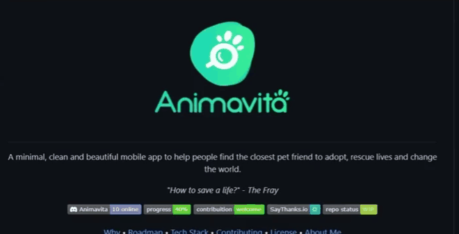

# Projeto com README
Um projeto de teste com um arquivo README 👍

[](https://google.com)

## Tecnologias utilizadas
- HTML
- CSS
- JS

## Como utilizar

1 - Clone o projeto
```
git clone <git clone https://github.com/Abel-V-Pereira/repositorio-com-readme.git>
```

2 - Acesse a pasta do projeto
```
cd repositorio-com-readme
```